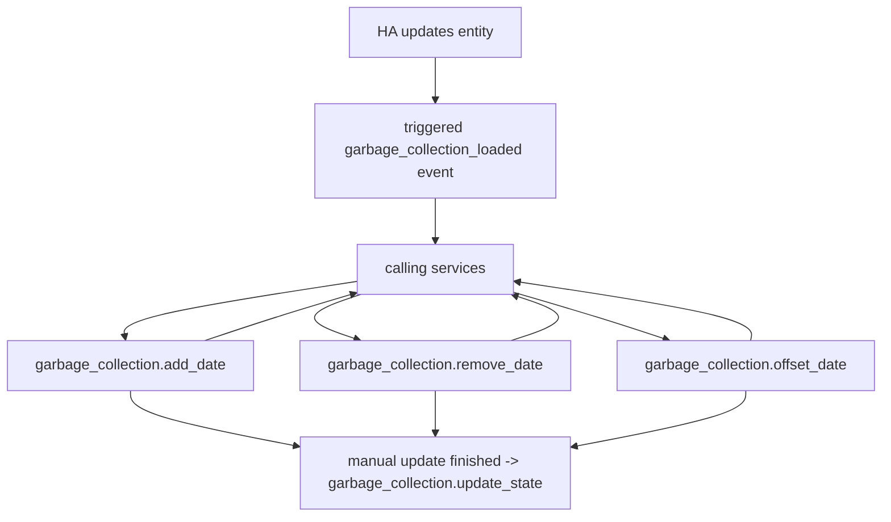

[](https://github.com/hacs/integration) [](https://github.com/bruxy70/Garbage-Collection) 

[](https://www.buymeacoffee.com/3nXx0bJDP)

## Table of Contents

- [Description](#garbage-collection)
- [Installation](#installation)

  - [Manual Installation](#manual-installation)
  - [Installation via Home Assistant Community Store (HACS)](#installation-via-home-assistant-community-store-hacs)

- [Configuration](#configuration)
- [Blueprints for Manual Update](#blueprints-for-manual-update)
  - [Public Holidays](#public-holidays)
  - [Include and Exclude](#include-and-exclude)
  - [Offset](#offset)
  - [Import TXT](#import-txt)
  - [Monthly on a fixed date](#monthly-on-a-fixed-date)
- [State and Attributes](#state-and-attributes)
- [Lovelace configuration examples](#lovelace-config-examples)

# Garbage Collection

The `garbage_collection` component is a Home Assistant helper that creates a custom sensor for monitoring a regular garbage collection schedule. The sensor can be configured for a number of different patterns:

- `weekly` schedule (including multiple collection days, e.g. on Tuesday and Thursday)
- `every-n-weeks` repeats every `period` of weeks, starting from the week number `first_week`. It uses the week number - therefore, it restarts each year, as the weeks start from number 1 each year.
- bi-weekly in `even-weeks` or `odd-weeks` (technically, it is the same as every 2 weeks with 1<sup>st</sup> or 2<sup>nd</sup> `first_week`)
- `every-n-days` (repeats regularly from the given first date). If n is a multiply of 7, it works similar to `every-n-weeks`, with the difference that it does not use the week numbers (that restart each year) but continues infinitely from the initial date.
- `monthly` schedule (n<sup>th</sup> weekday each month), or a specific weekday of each n<sup>th</sup> week. Using the `period` it could also be every 2<sup>nd</sup>, 3<sup>rd</sup> etc month.
- `annually` (e.g. birthdays). This is once per year. Using include dates, you can add additional dates manually.
- `blank` does not automatically schedule any collections - to be used in cases where you want to make completely own schedule with `manual_update`.

You can also configure seasonal calendars (e.g. for bio-waste collection), by configuring the first and last month.
And you can `group` entities, which will merge multiple schedules into one sensor.

These are some examples using this sensor. The Lovelace config examples are included below.


## Installation

### MANUAL INSTALLATION

1. Download the
   [latest release](https://github.com/bruxy70/garbage_collection/releases/latest).
2. Unpack the release and copy the `custom_components/garbage_collection` directory
   into the `custom_components` directory of your Home Assistant
   installation.
3. Restart Home Assistant.
4. Configure the `garbage_collection` helper.

### INSTALLATION VIA Home Assistant Community Store (HACS)

1. Ensure that [HACS](https://hacs.xyz/) is installed.
2. Search for and install the "Garbage Collection" integration.
3. Restart Home Assistant.
4. Configure the `garbage_collection` helper.

## Configuration

Go to `Settings`/`Devices & Services`/`Helpers`, click on the `+ CREATE HELPER` button, select `Garbage Collection` and configure the helper.<br />If you would like to add more than one collection schedule, click on the `+ CREATE HELPER` button again and add another `Garbage Collection` helper instance.

**The configuration hapend in 2 steps.** In the first step, you select the `frequency` and common parameters. In the second step you configure additional parameters depending on the selected frequency.

_The configuration via `configuration.yaml` has been deprecated. If you have previously configured the integration there, it will be imported to ConfigFlow, and you should remove it._

### STEP 1 - Common Parameters

| Parameter           | Required | Description                                                                                                                                                                                                                                                                                                                                                                          |
| :------------------ | :------- | :----------------------------------------------------------------------------------------------------------------------------------------------------------------------------------------------------------------------------------------------------------------------------------------------------------------------------------------------------------------------------------- |
| `Friendly name`     | Yes      | Sensor friendly name                                                                                                                                                                                                                                                                                                                                                                 |
| `Frequency`         | Yes      | `"weekly"`, `"even-weeks"`, `"odd-weeks"`, `"every-n-weeks"`, `"every-n-days"`, `"monthly"`, `"annual"`, `"group"` or `"blank"`                                                                                                                                                                                                                                                      |
| `Icon`              | No       | Default icon **Default**: `mdi:trash-can`                                                                                                                                                                                                                                                                                                                                            |
| `Icon today`        | No       | Icon if the collection is today **Default**: `mdi:delete-restore`                                                                                                                                                                                                                                                                                                                    |
| `Icon tomorrow`     | No       | Icon if the collection is tomorrow **Default**: `mdi:delete-circle`                                                                                                                                                                                                                                                                                                                  |
| `Expire After`      | No       | Time in format format `HH:MM`. If the collection is due today, start looking for the next occurence after this time (i.e. if the weekly collection is in the morning, change the state from 'today' to next week in the afternoon)                                                                                                                                                   |
| `Verbose state`     | No       | The sensor state will show collection date and remaining days, instead of number **Default**: `False`                                                                                                                                                                                                                                                                                |
| `Hidde in calendar` | No       | Hide in calendar (useful for sensors that are used in groups)<br/>**Default**: `False`                                                                                                                                                                                                                                                                                               |
| `Manual update`     | No       | (Advanced). Do not automatically update the status. Status is updated manualy by calling the service `garbage_collection.update_state` from an automation triggered by event `garbage_collection_loaded`, that could manually add or remove collection dates, and manually trigger the state update at the end. [See the example](#manual-update-examples).</br>**Default**: `False` |
| `Verbose format`    | No       | (relevant when `verbose state` is `True`). Verbose status formatting string. Can use placeholders `{date}` and `{days}` to show the date of next collection and remaining days. **Default**: `'on {date}, in {days} days'`</br>_When the collection is today or tomorrow, it will show `Today` or `Tomorrow`_</br>_(currently in English, French, Czech and Italian)._               |
| `Date format`       | No       | In the `verbose format`, you can configure the format of date (using [strftime](http://strftime.org/) format) **Default**: `'%d-%b-%Y'`                                                                                                                                                                                                                                              |

### STEP 2 - parameters depending on the selected frequency

#### ...FOR ALL FREQUENCIES EXCEPT ANNUAL, GROUP and BLANK

| Parameter     | Required | Description                                                                        |
| :------------ | :------- | :--------------------------------------------------------------------------------- |
| `First month` | No       | Month three letter abbreviation, e.g. `"jan"`, `"feb"`...<br/>**Default**: `"jan"` |
| `Last month`  | No       | Month three letter abbreviation.<br/>**Default**: `"dec"`                          |

#### ...FOR ALL FREQUENCIES EXCEPT ANNUAL, EVERY-N-DAYS, GROUP and BLANK

| Parameter         | Required | Description                                                                                           |
| :---------------- | :------- | :---------------------------------------------------------------------------------------------------- |
| `Collection days` | Yes      | Day three letter abbreviation, list of `"mon"`, `"tue"`, `"wed"`, `"thu"`, `"fri"`, `"sat"`, `"sun"`. |

#### ...FOR COLLECTION EVERY-N-WEEKS

| Parameter    | Required | Description                                                                                                                                                                                                                                                                                                                                                                                                                                                                                                                                                                                                                                                                                                                                                                             |
| :----------- | :------- | :-------------------------------------------------------------------------------------------------------------------------------------------------------------------------------------------------------------------------------------------------------------------------------------------------------------------------------------------------------------------------------------------------------------------------------------------------------------------------------------------------------------------------------------------------------------------------------------------------------------------------------------------------------------------------------------------------------------------------------------------------------------------------------------- |
| `Period`     | No       | Collection every `"period"` weeks (integer 1-53)<br/>**Default**: 1                                                                                                                                                                                                                                                                                                                                                                                                                                                                                                                                                                                                                                                                                                                     |
| `First week` | No       | First collection on the `"first week"` week (integer 1-53)<br/>**Default**: 1<br/>_(The week number is using [ISO-8601](https://en.wikipedia.org/wiki/ISO_8601#Week_dates) numeric representation of the week)<br/><br/>Note: This parameter cannot be used to set the beginning of the collection period (use the `first month` parameter for that). The purpose of `first week` is to simply 'offset' the week number, so the collection every ;'n' weeks does not always trigger on week numbers that are multiplication of 'n'. Technically, the value of this parameter shall be less than `period`, otherwise it will give weird results. Also note, that the week numbers restart each year. Use `every-n-days` frequency if you need a consistent period across the year ends._ |

#### ...FOR COLLECTION EVERY-N-DAYS

| Parameter    | Required | Description                                                                                                                                           |
| :----------- | :------- | :---------------------------------------------------------------------------------------------------------------------------------------------------- |
| `First date` | Yes      | Repeats every n days from this first date<br/>(date in the international ISO format `'yyyy-mm-dd'`).                                                  |
| `Period`     | No       | Collection every `"period"` days (warning - in this configuration, it is days, not weeks!)<br/>**Default**: 1 (daily, which makes no sense I suppose) |

#### ...FOR MONTHLY COLLECTION

The monthly schedule has two flavors: it can trigger either on the **n<sup>th</sup> occurrence of the weekday** in a month, or on the weekday in the **n<sup>th</sup> week** of each month.

| Parameter                                 | Required | Description                                                                                                                                                                                                                                                                                                                                                                                                                                                                                                                                                                                                                                           |
| :---------------------------------------- | :------- | :---------------------------------------------------------------------------------------------------------------------------------------------------------------------------------------------------------------------------------------------------------------------------------------------------------------------------------------------------------------------------------------------------------------------------------------------------------------------------------------------------------------------------------------------------------------------------------------------------------------------------------------------------- |
| `Order of weekday`                        | Yes      | List of week numbers of `collection day` each month. E.g., if `collection_day` is `"sat"`, 1 will mean 1<sup>st</sup> Saturday each month (integer 1-5)                                                                                                                                                                                                                                                                                                                                                                                                                                                                                               |
| `Order of week, instead of weekday order` | No       | **CONFIGURE THIS ONE ONLY IF YOU ARE SURE YOU NEED IT**. This will **alter** the behaviour of `order of weekday`, so that instead of n<sup>th</sup> weekday of each month, take the weekday of the n<sup>th</sup> week of each month.</br>So if the month starts on Friday, the Wednesday of the 1<sup>st</sup> week would actually be last Wednesday of the previous month and the Wednesday of 2<sup>nd</sup> week will be the 1<sup>st</sup> Wednesday of the month. So if you have just randomy clicked on the option, it might appear as if it calculates a wrong date! Yes, this is confusing, but there are apparently some use case for this. |
| `Period`                                  | No       | If `period` is not defined (or 1), the schedule will repeat monthly. If `period` is 2, it will be every 2<sup>nd</sup> month. If `period` is 3, it will be once per quarter, and so on.<br/>The `first month` parameter will then define the starting month. So if the `first month` is `jan` (or not defined), and `period` is 2, the collection will be in odd months (`jan`, `mar`, `may`, `jul`, `sep` and `nov`). If `first month` is `feb`, it will be in even months. (integer 1-12)<br/>**Default**: 1                                                                                                                                        |

#### ...FOR ANNUAL COLLECTION

| Parameter | Required | Description                                                                          |
| :-------- | :------- | :----------------------------------------------------------------------------------- |
| `Date`    | Yes      | The date of collection, in format `'mm/dd'` (e.g. '11/24' for November 24 each year) |

#### ...FOR GROUP

| Parameter          | Required | Description                     |
| :----------------- | :------- | :------------------------------ |
| `List of entities` | Yes      | A list of `entity_id`s to merge |

## Blueprints for Manual Update

### Prerequisites

1. To use the **blueprints**, you need to set the `garbage_collection` entity for `Manual update`, that will fire the `garbage_collection_loaded` event on each sensor update and trigger the automation **blueprint**.
2. Install/Import **blueprint**
3. From the **blueprint**, create and configure the automation

### Public Holidays

There are a couple of **blueprints**, automatically moving the collection falling on a public holiday. Or if there was a public holiday in the week before the scheduled collection.

The Public Holidays **blueprints** use a separate custom helper **Holidays**, available through **HACS**, that you can configure for different countries.

| <!-- -->                                                                                                                                                                                                                                                                                                                                                                            | <!-- -->                                                                                                                                                                                                                                                                                                                                                                                                   |
| :---------------------------------------------------------------------------------------------------------------------------------------------------------------------------------------------------------------------------------------------------------------------------------------------------------------------------------------------------------------------------------- | :--------------------------------------------------------------------------------------------------------------------------------------------------------------------------------------------------------------------------------------------------------------------------------------------------------------------------------------------------------------------------------------------------------- |
| [](https://my.home-assistant.io/redirect/blueprint_import/?blueprint_url=https%3A%2F%2Fgithub.com%2Fbruxy70%2FGarbage-Collection%2Fblob%2Fmaster%2Fblueprints%2Fmove_on_holiday.yaml)                      | Move the collection to the next day, if the collection falls on public holiday                                                                                                                                                                                                                                                                                                                             |
| [](https://my.home-assistant.io/redirect/blueprint_import/?blueprint_url=https%3A%2F%2Fgithub.com%2Fbruxy70%2FGarbage-Collection%2Fblob%2Fmaster%2Fblueprints%2Fmove_on_holiday_with_include_exclude.yaml) | Remove events falling on provided "exclude" list of dates. Then check the calendar of public holidays and move events that fall on a public holiday to the next day. Finally, add additional events on dates from "include" list.                                                                                                                                                                          |
| [](https://my.home-assistant.io/redirect/blueprint_import/?blueprint_url=https%3A%2F%2Fgithub.com%2Fbruxy70%2FGarbage-Collection%2Fblob%2Fmaster%2Fblueprints%2Fholiday_in_week.yaml)                      | Move forward one day if a public holiday was in the collection week, before or on the collection day (and keep moving if the new collection day also falls on a holiday)                                                                                                                                                                                                                                   |
| [](https://my.home-assistant.io/redirect/blueprint_import/?blueprint_url=https%3A%2F%2Fgithub.com%2Fbruxy70%2FGarbage-Collection%2Fblob%2Fmaster%2Fblueprints%2Fmultiple_holidays_in_week.yaml)            | Move forward by a day for each public holiday was in the collection week, before or on the collection day (and keep moving if the new collection day also falls on a holiday). So if there were two public holidays, move by two days.                                                                                                                                                                     |
| [](https://my.home-assistant.io/redirect/blueprint_import/?blueprint_url=https%3A%2F%2Fgithub.com%2Fbruxy70%2FGarbage-Collection%2Fblob%2Fmaster%2Fblueprints%2Fmove_on_holiday_carry_over.yaml)           | Move forward by one day if there was a public holiday in the collection week, before or on the collection day (and keep moving if the new collection day also falls on a holiday). Only move by one day, but if there was more than one public holiday in the week, carry it over to the following week. So if there were 2 public holidays this week, move it by one day this week and one day next week. |
| [](https://my.home-assistant.io/redirect/blueprint_import/?blueprint_url=https%3A%2F%2Fgithub.com%2Fbruxy70%2FGarbage-Collection%2Fblob%2Fmaster%2Fblueprints%2Fskip_holday.yaml)                          | Skip the holiday                                                                                                                                                                                                                                                                                                                                                                                           |

### Include and Exclude

A list of fixed dates to include and exclude from the calculated schedule.

| <!-- -->                                                                                                                                                                                                                                                                                                                                                       | <!-- -->            |
| :------------------------------------------------------------------------------------------------------------------------------------------------------------------------------------------------------------------------------------------------------------------------------------------------------------------------------------------------------------- | :------------------ |
| [](https://my.home-assistant.io/redirect/blueprint_import/?blueprint_url=https%3A%2F%2Fgithub.com%2Fbruxy70%2FGarbage-Collection%2Fblob%2Fmaster%2Fblueprints%2Finclude_exclude.yaml) | Include and Exclude |
| [](https://my.home-assistant.io/redirect/blueprint_import/?blueprint_url=https%3A%2F%2Fgithub.com%2Fbruxy70%2FGarbage-Collection%2Fblob%2Fmaster%2Fblueprints%2Finclude.yaml)         | Include             |
| [](https://my.home-assistant.io/redirect/blueprint_import/?blueprint_url=https%3A%2F%2Fgithub.com%2Fbruxy70%2FGarbage-Collection%2Fblob%2Fmaster%2Fblueprints%2Fexclude.yaml)         | Exclude             |

### Offset

The offset blueprint will move the calculated collections by a number of days. This can be used, for example, to schedule collection for last Saturday each month - just set the collection to the first Saturday each month and offset it by -7 days.

[](https://my.home-assistant.io/redirect/blueprint_import/?blueprint_url=https%3A%2F%2Fgithub.com%2Fbruxy70%2FGarbage-Collection%2Fblob%2Fmaster%2Fblueprints%2Foffset.yaml)

### Import txt

This **blueprint** requires a `command_line` sensor reading content of a txt file, containig a set of dates, one per line.

[](https://my.home-assistant.io/redirect/blueprint_import/?blueprint_url=https%3A%2F%2Fgithub.com%2Fbruxy70%2FGarbage-Collection%2Fblob%2Fmaster%2Fblueprints%2Fimport_txt.yaml)

<details>
<summary>command_line sensor example</summary>

The Home Assistant command line sensor has a 255 character limitation. For many people this causes an issue where the sensor only imports part of the list. To overcome this limitation, @stu1811 came up with this brilliant solution.

Create a script that shows next 20 dates from the current day forward.

#### **`/share/import_dates.sh`**

```bash
#!/bin/bash
new_dates=$(for x in $(cat /share/import_dates.txt); do
                if [[ $(date -d $x +"%y%m%d") -ge $(date +"%y%m%d") ]]; then
                    echo $x
                fi
            done)
echo "$new_dates" | head -n20
```

Then, create the command line sensor taking the output of this script.

#### **`configuration.yaml`**

```yaml
sensor:
  - platform: command_line
    name: Import dates
    command: "sh /share/import_dates.sh"
```

</details>

### Monthly on a fixed date

This will create a schedule on a fixed date each month. For example on the 3rd each month. The helper does not allow it, as it is generally designed around paterns evolving around weekly schedules (since garbage collection typically happens on a set day in a week, rather than set day in a month). But few of you wanted that, so here you go.

[](https://my.home-assistant.io/redirect/blueprint_import/?blueprint_url=https%3A%2F%2Fgithub.com%2Fbruxy70%2FGarbage-Collection%2Fblob%2Fmaster%2Fblueprints%2Fmonthly_fixed_date.yaml) One fixed date

[](https://my.home-assistant.io/redirect/blueprint_import/?blueprint_url=https%3A%2F%2Fgithub.com%2Fbruxy70%2FGarbage-Collection%2Fblob%2Fmaster%2Fblueprints%2Fmonthly_fixed_two_dates.yaml) Two dates

## STATE AND ATTRIBUTES

### State

The state can be one of

| Value | Meaning                |
| :---- | :--------------------- |
| `0`   | Collection is today    |
| `1`   | Collection is tomorrow |
| `2`   | Collection is later    |

If the `verbose_state` parameter is set, it will show the date, and the remaining days. For example: "Today" or "Tomorrow" or "on 10-Sep-2019, in 2 days" (configurable)

### Attributes

| Attribute         | Description                              |
| :---------------- | :--------------------------------------- |
| `next_date`       | The date of next collection              |
| `days`            | Days till the next collection            |
| `last_collection` | The date and time of the last collection |

## Services

### `garbage_collection.collect_garbage`

If the collection is scheduled for today, mark it completed and look for the next collection.
It will set the `last_collection` attribute to the current date and time.

| Attribute         | Description                                                                                                                                                                                                                              |
| :---------------- | :--------------------------------------------------------------------------------------------------------------------------------------------------------------------------------------------------------------------------------------- |
| `entity_id`       | The garbage collection entity id (e.g. `sensor.general_waste`)                                                                                                                                                                           |
| `last_collection` | (optional) Set the last collection date to this value. This can be used to re-set the next collection calculation, if the last collection date was set in error. If omitted, it will set the last collection to the current date & time. |

## Manual update

There are standard [blueprints](#blueprints-for-manual-update) provided to handle manual updates - to move collection on public holidays or offset the collection.

If these **blueprints** do not work for you, you can create your own custom rules to handle any scenario. If you do so, please share the blueprints with the others by posting them to the [blueprints directory](https://github.com/bruxy70/Garbage-Collection/tree/master/blueprints) - someone else might find them useful. Thanks!
To help you with creating custom automations, see the following examples:

## _!!! Advanced !!! If you think this is too complicated, then this is not for you!!!_

<details>

## Services used for `manual_update`

The following services are used within automations, triggered by the [garbage_collection_loaded](#garbage_collection_loaded) event. Don't use them anywhere else, it won't work. For the examples of their use, see the [examples](#manual-update-examples)



### `garbage_collection.add_date`

Add a date to the list of dates calculated automatically. To add multiple dates, call this service multiple-times with different dates.
Note that this date will be removed on the next sensor update, when the data is re-calculated and loaded. This is why, this service should be called from the automation triggered by the event `garbage_collection_loaded`. This event is called each time the sensor is updated. And at the end of this automation, you need to call the `garbage_collection.update_state` service to update the sensor state based on automatically collected dates, and the dates added, removed, or offset by the automation.

| Attribute   | Description                                                                                  |
| :---------- | :------------------------------------------------------------------------------------------- |
| `entity_id` | The garbage collection entity id (e.g. `sensor.general_waste`)                               |
| `date`      | The date to be added, in ISO format (`'yyyy-mm-dd'`). Make sure to enter the date in quotes! |

### `garbage_collection.remove_date`

Remove a date to the list of dates calculated automatically. To remove multiple dates, call this service multiple-times with different dates.
Note that this date will be removed on the next sensor update, when the data is re-calculated and loaded. This is why, this service should be called from the automation triggered by the event `garbage_collection_loaded`. This event is called each time the sensor is updated. And at the end of this automation, you need to call the `garbage_collection.update_state` service to update the sensor state based on automatically collected dates, and the dates added, removed, or offset by the automation.

| Attribute   | Description                                                                                    |
| :---------- | :--------------------------------------------------------------------------------------------- |
| `entity_id` | The garbage collection entity id (e.g. `sensor.general_waste`)                                 |
| `date`      | The date to be removed, in ISO format (`'yyyy-mm-dd'`). Make sure to enter the date in quotes! |

### `garbage_collection.offset_date`

Offset the calculated collection day by the `offset` number of days.
Note that this date will be removed on the next sensor update, when the data is re-calculated and loaded. This is why, this service should be called from the automation triggered by the event `garbage_collection_loaded`. This event is called each time the sensor is updated. And at the end of this automation, you need to call the `garbage_collection.update_state` service to update the sensor state based on automatically collected dates, and the dates added, removed, or offset by the automation.

| Attribute   | Description                                                                                    |
| :---------- | :--------------------------------------------------------------------------------------------- |
| `entity_id` | The garbage collection entity id (e.g. `sensor.general_waste`)                                 |
| `date`      | The date to be removed, in ISO format (`'yyyy-mm-dd'`). Make sure to enter the date in quotes! |
| `offset`    | By how many days to offset - integer between `-31` to `31` (e.g. `1`)                          |

### `garbage_collection.update_state`

Choose the next collection date from the list of dates calculated automatically, added by service calls (and not removed), and update the entity state and attributes.

| Attribute   | Description                                                    |
| :---------- | :------------------------------------------------------------- |
| `entity_id` | The garbage collection entity id (e.g. `sensor.general_waste`) |

## Events

### `garbage_collection_loaded`

This event is triggered each time a `garbage_collection` entity is being updated. You can create an automation to modify the collection schedule before the entity state update.

Event data:
| Attribute | Description |
| :-- | :-- |
| `entity_id` | The garbage collection entity id (e.g. `sensor.general_waste`) |
| `collection_dates` | List of collection dates calculated automatically. |

## Manual update examples

For the example below, the entity should be configured with `manual_update` set to `true`.
Then, when the `garbage_collection` entity is updated (normally once a day at midnight, or restart, or when triggering entity update by script), it will calculate the collection schedule for previous, current and next year. But it will **NOT UPDATE** the entity state.
Instead, it will trigger an event `garbage_collection_loaded` with a list of automatically calculated dates as a parameter.
You will **have to create an automation triggered by this event**. In this automation, you will need to call the service `garbage_collection.update_state` to update the state. Before that, you can call the services `garbage_collection.add_date` and/or `garbage_collection.remove_date` and/or `garbage_collection.offset_date` to programmatically tweak the dates in whatever way you need (e.g. based on values from external API sensor, comparing the dates with the list of holidays, calculating custom offsets based on the day of the week etc.). This is complicated but gives you the ultimate flexibility.

## Simple example

Adding an extra collection date (a fixed date in this case) - for the entity `sensor.test`.

```yaml
alias: garbage_collection event
description: "Manually add a collection date, then trigger entity state update."
trigger:
  - platform: event
    event_type: garbage_collection_loaded
    event_data:
      entity_id: sensor.test
action:
  - service: garbage_collection.add_date
    data:
      entity_id: "{{ trigger.event.data.entity_id }}"
      date: "2022-01-07"
  - service: garbage_collection.update_state
    data:
      entity_id: sensor.test
mode: single
```

## Moderate example

This will loop through the calculated dates, and add an extra collection to a day after each calculated one. So if this is set for a collection every first Wednesday each month, it will result in a collection on the first Wednesday, and the following day (kind of first Thursday, except if the week is starting on Thursday - just a random weird example :).

This example is for an entity `sensor.test`. If you want to use it for yours, replace it with the real entity name in the trigger.

```yaml
alias: test garbage_collection event
description: "Loop through all calculated dates, add extra collection a day after the calculate one"
trigger:
  - platform: event
    event_type: garbage_collection_loaded
    event_data:
      entity_id: sensor.test
action:
  - repeat:
      for_each: "{{ trigger.event.data.collection_dates }}"
      sequence:
        - service: garbage_collection.add_date
          data:
            entity_id: "{{ trigger.event.data.entity_id }}"
            date: >-
              {{( as_datetime(repeat.item) + timedelta( days = 1)) | as_timestamp | timestamp_custom("%Y-%m-%d") }}
  - service: garbage_collection.update_state
    data:
      entity_id: "{{ trigger.event.data.entity_id }}"
mode: single
```

## Advanced example

This is an equivalent of "holiday in week" move - checking if there is a public holiday on the calculated collection day, or earlier in the week. And if yes, moving the collection by one day. This is fully custom logic, so it could be further complicated by whatever rules anyone wants.

This example is for an entity `sensor.test`. If you want to use it for yours, replace it with a real entity name in the trigger.

```yaml
alias: test garbage_collection event
description: >-
  Loop through all calculated dates, move the collection by 1 day if a public holiday was in the week before or on the calculated collection date calculate one
trigger:
  - platform: event
    event_type: garbage_collection_loaded
    event_data:
      entity_id: sensor.test
action:
  - repeat:
      for_each: "{{ trigger.event.data.collection_dates }}"
      sequence:
        - condition: template
          value_template: >-
            
            
            
              {%- set d = ( collection_date + timedelta( days=-i) ) | as_timestamp | timestamp_custom("%Y-%m-%d") %}
              
                
              
              
            {{ ns.found }}
        - service: garbage_collection.offset_date
          data:
            entity_id: "{{ trigger.event.data.entity_id }}"
            date: "{{ repeat.item }}"
            offset: 1
  - service: garbage_collection.update_state
    data:
      entity_id: "{{ trigger.event.data.entity_id }}"
mode: single
```

Or you can use the [blueprints](#blueprints-for-manual-update) I made for you. And you are welcome to create your own and share with others.

</details>

# Lovelace config examples

For information/inspiration - not supported.

<details>

## Garbage Collection custom card

You can use the custom [garbage collection card](https://github.com/amaximus/garbage-collection-card) developed by @amaximus.


## With images (picture-entity)

This is what I use (I like images). I use a horizontal stack of picture-entities, with `card-templater` plugin ([Lovelace Card Templater](https://github.com/gadgetchnnel/lovelace-card-templater)) to show the number of days:


(The `state` is designed to be used as traffic lights. That's why it has 3 values. You obviously cannot use this with `verbose_state`)

This is the configuration

```yaml
- type: "custom:card-templater"
  card:
    type: picture-entity
    name_template: >-
      {{ state_attr('sensor.bio','days') }} days
    show_name: True
    show_state: False
    entity: sensor.bio
    state_image:
      "0": "/local/containers/bio_today.png"
      "1": "/local/containers/bio_tomorrow.png"
      "2": "/local/containers/bio_off.png"
  entities:
    - sensor.bio
```

## List view (entities)

The simplest visualization is to use entities. In this case, I use `verbose_state` to show `state` as text.


Lovelace configuration

```yaml
- type: entities
  entities:
    - sensor.general_waste
    - sensor.bio
    - sensor.paper
    - sensor.plastic
```

## Icon view (glance)


Lovelace Configuration

```yaml
- type: glance
  entities:
    - sensor.general_waste
```

</details>
